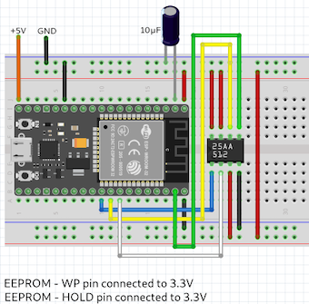
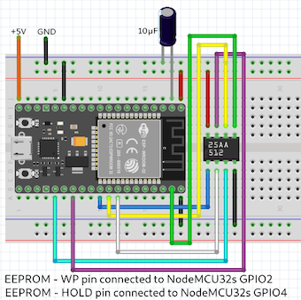

# NodeMCU32s and 25AA512 SPI EEPROM

ESP-IDF library for 25AA512 SPI EEPROM.

The codes have been written using VSCODE + PlatformIO IDE (Core 6.1.5, Home 3.4.3) + Espressif 32 (5.2.0).

For testing I used these two types of connections. 

The functions (examples), which are in the main.c file worked fine.
Uncommenting the example functions you can test the read and write data in to eeprom and status register, erase data from eeprom and other functions given by eeprom.

Arduino library for SPI based EEPROMs can be found on
https://wolles-elektronikkiste.de/en/eeprom-part-3-external-spi-eeproms
